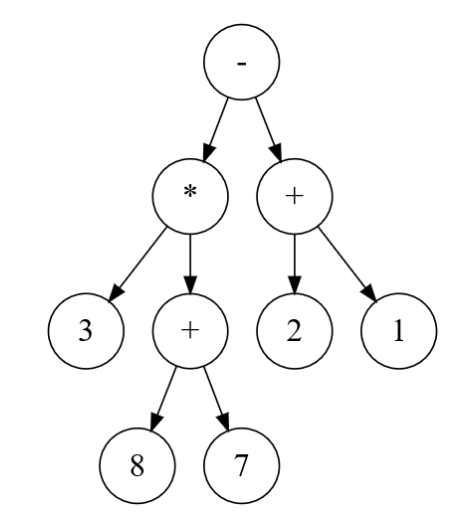
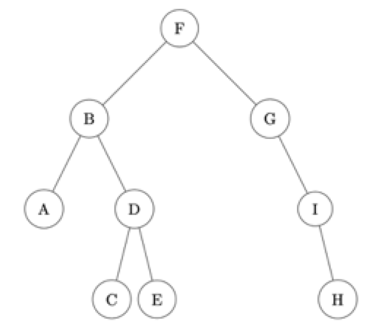

.. TNSI

.. toctree::
   :maxdepth: 1

Epreuve pratique
================

Sujet 03 - Exercice 2
---------------------

Une expression arithmétique ne comportant que les quatre opérations +, -, x, ÷ peut être représentée sous forme d’arbre
binaire. Les noeuds internes sont des opérateurs et les feuilles sont des nombres. Dans un tel arbre, la disposition
des noeuds joue le rôle des parenthèses que nous connaissons bien.

En parcourant en profondeur infixe l’arbre binaire ci-dessous, on retrouve l’expression notée habituellement :

.. math::

   3 \times (8 + 7) - (2 + 1)

La classe ``Noeud`` ci-après permet d’implémenter une structure d’arbre binaire.

Compléter la fonction récursive ``expression_infixe`` qui prend en paramètre un objet de la classe Noeud et qui renvoie
l’expression arithmétique représentée par l’arbre binaire passé en paramètre, sous forme d’une chaîne de caractères contenant
des parenthèses.

Résultat attendu avec l’arbre ci-dessus :

>>> e = Noeud(Noeud(Noeud(None, 3, None), '*', Noeud(Noeud(None, 8, None), '+', Noeud(None, 7, None))), '-', Noeud(Noeud(None, 2, None), '+', Noeud(None, 1, None)))

>>> expression_infixe(e)
'((3*(8+7))-(2+1))'

.. literalinclude:: ../python/22_NSI_03.py
   :lines: 1-

Sujet 27 - Exercice 1
---------------------

Dans cet exercice, un arbre binaire de caractères est stocké sous la forme d’un dictionnaire où les clefs sont les
caractères des noeuds de l’arbre et les valeurs, pour chaque clef, la liste des caractères des fils gauche et droit du noeud.

Par exemple, l’arbre

est stocké dans:
   
>>> a = {'F':['B','G'], 'B':['A','D'], 'A':['',''], 'D':['C','E'], 'C':['',''], 'E':['',''], 'G':['','I'], 'I':['','H'], 'H':['','']}

Écrire une fonction récursive ``taille`` prenant en paramètres un arbre binaire arbre sous la forme d’un dictionnaire et un
caractère lettre qui est la valeur du sommet de l’arbre, et qui renvoie la taille de l’arbre à savoir le nombre total
de noeud.

On pourra distinguer les 4 cas où les deux « fils » du noeud sont ``''``, le fils gauche seulement est ``''``, le fils droit
seulement est ``''``, aucun des deux fils n’est ``''``.

.. rubric:: Exemple :

>>> taille(a,'F')
9
